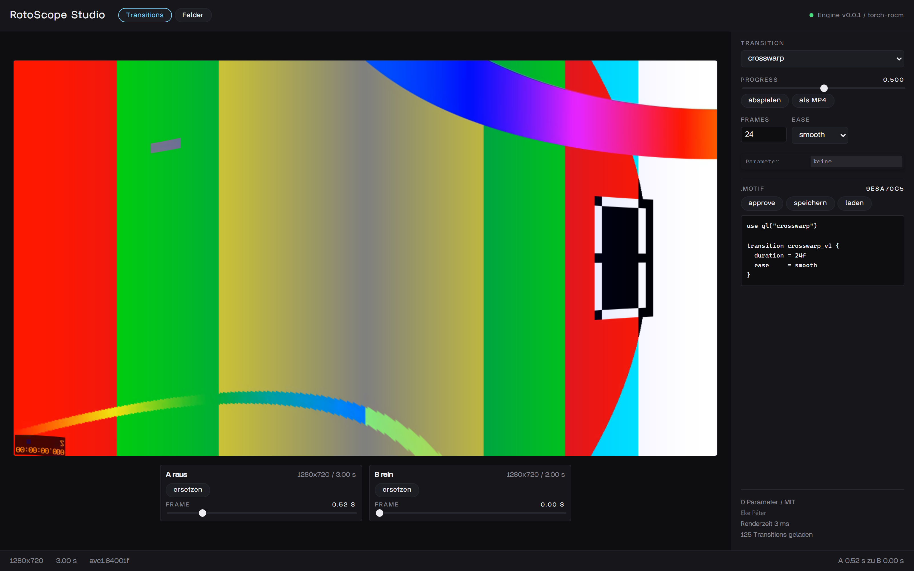
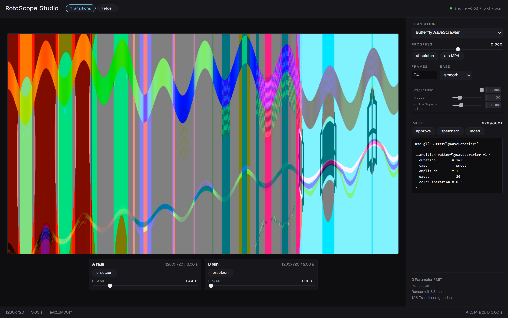
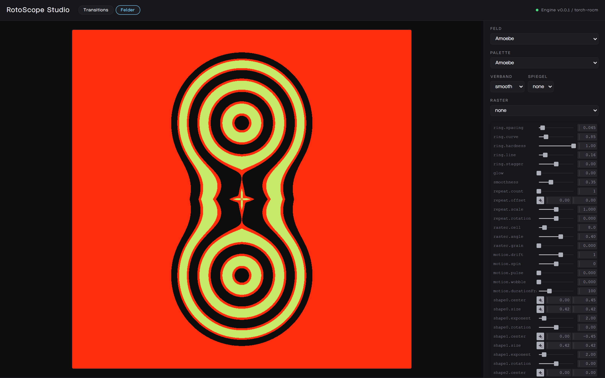
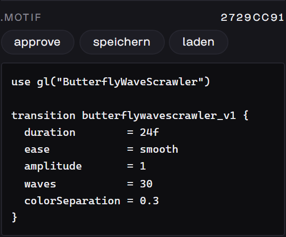
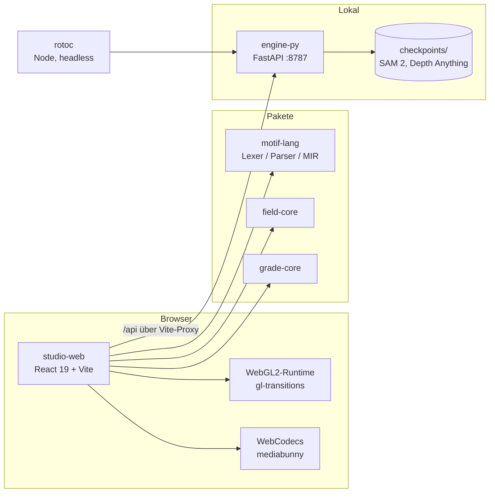

<div align="center">

# RotoScope Studio

**Lokales Werkzeug für Videoübergänge, generative Felder und KI-gestütztes Rotoscoping — offline, mit jedem Parameter offen.**




</div>

[Was es macht](#was-es-macht) · [Screenshots](#screenshots) · [Stack](#stack) · [Setup](#setup) · [Nutzung](#nutzung) · [Status](#status) · [Architektur](#architektur)

> **Das verbindliche Briefing ist [PROJECT_PROMPT.md](PROJECT_PROMPT.md).** Architektur,
> Use-Cases, Bausteine, Milestones und die Sprachdefinition stehen dort — nicht hier.

## Was es macht

RotoScope blendet zwei Videoclips über einen von 125 GL-Übergängen ineinander, wobei beide
Clips während der Überblendung weiterlaufen. Jeder Parameter des Übergangs liegt offen und wirkt
sofort auf das Bild. Der eingestellte Zustand wird nicht als Preset gespeichert, sondern als
`.motif`-Textdatei — lesbar, versionierbar, inhaltsadressiert über einen Hash. Ein zweiter
Modus erzeugt generative Felder aus Formen, Rastern und Bewegung. Eine Python-Engine daneben
hält die Modelle für Segmentierung und Tiefenkarten und spricht über HTTP mit der App.

## Screenshots

Der Hero oben zeigt die Transitions-Ansicht: zwei Clips (1280×720) über `crosswarp` bei halber
Strecke, rechts der Inspector, unten die Slots mit frei wählbarem Ein- und Ausstiegsframe.

<table>
<tr>
<td width="50%">

<sub><b>Parameter-Inspector.</b> <code>ButterflyWaveScrawler</code> mit seinen drei Parametern. Der Inspector wird automatisch aus den Shader-Uniforms gebaut — jede Änderung landet unmittelbar im <code>.motif</code>-Text und ändert dessen Hash.</sub>
</td>
<td width="50%">

<sub><b>Feldgenerator.</b> Der zweite Modus: Felder aus Formen, Wiederholung, Raster und Bewegung. Preset <code>Amoebe</code>, Parameterbaum vollständig offen.</sub>
</td>
</tr>
<tr>
<td width="50%">

<sub><b>Motif-Panel.</b> Derselbe Übergang als Text. Das ist das Speicherformat, nicht eine Ansicht davon — inhaltsadressiert über den Hash oben rechts.</sub>
</td>
<td width="50%"></td>
</tr>
</table>

## Stack

| Ebene | Technik |
|---|---|
| Oberfläche | React 19, Vite 6, TypeScript 5.7, Tweakpane 4 |
| Rendering | WebGL2 ([ADR 004](docs/decisions/004-webgl2-statt-webgpu.md)), gl-transitions 1.71 |
| Video | mediabunny 1.0 über WebCodecs — Dekodierung und Export im selben Pfad |
| Engine | Python 3.12, FastAPI, Uvicorn |
| Inferenz | PyTorch 2.9.1+rocm7.2.1 oder ONNX Runtime 1.24 + DirectML ([ADR 001](docs/decisions/001-inferenz-backend.md)) |
| CLI | `rotoc` — Node ohne Abhängigkeiten |
| Pakete | `motif-lang`, `field-core`, `grade-core` als npm-Workspaces |

## Setup

Voraussetzungen: **Node ≥ 20**, **[uv](https://docs.astral.sh/uv/)** (holt Python 3.12 selbst),
und für die Testclips **ffmpeg**.

```bash
npm install
```

```bash
npm run models
```

```bash
npm run testclips
```

Engine im ersten Terminal:

```bash
npm run engine
```

Web-App im zweiten, danach `http://localhost:5173`:

```bash
npm run dev
```

Umgebung prüfen:

```bash
npm run doctor
```

Alle Befehle oben sind am 2026-08-30 in einer frischen Shell durchgelaufen. `npm run doctor`
gibt dann aus:

```
node        26.7.0
engine      ok, v0.0.1 auf http://127.0.0.1:8787
python      3.12.13 (Windows 11)
  [ja]   torch-rocm     torch 2.9.1+rocm7.2.1 (ROCm/HIP 7.2.53211-158bd99533)
         device: AMD Radeon RX 7600 XT
  [ja]   onnx-dml       onnxruntime 1.24.4, Provider: DmlExecutionProvider, CPUExecutionProvider
backend     bevorzugt: torch-rocm
```

> Die Skripte `engine:win` und `engine:mac` sind **nicht** verifiziert und richten auf einer
> eingerichteten Maschine Schaden an — siehe [Status](#status).

### Checkpoints

Modelle liegen **nicht** im Repo: mehrere hundert MB, und ihre Lizenzen erlauben eine Weitergabe
nicht durchgehend. `npm run models` holt genau die, deren Lizenz geprüft und freigegeben ist.
Jedes hat eine Datei unter [docs/licenses/](docs/licenses/) — ohne die wird nichts eingebunden.

### Schrift

Die Oberfläche ist auf **Endless** gesetzt, eine Schrift mit 94 Glyphen, reines ASCII. Die Datei
liegt **nicht im Repo**: sie trägt keine Lizenzangabe, und fremde Schriften weiterzugeben ist
keine Kleinigkeit. Wer sie hat, legt sie nach `apps/studio-web/public/fonts/Endless.ttf`; ist sie
systemweit installiert, findet die App sie über `local('Endless')`.

Ohne sie fällt die Oberfläche auf die Systemschrift zurück und funktioniert vollständig — nur das
Satzbild ist ein anderes. Die Beschriftung ist bewusst umlautfrei gehalten, weil Endless keine
Umlaute hat; das bleibt so, damit beide Fälle gleich aussehen. Die Screenshots oben zeigen Endless.

### Zielumgebung

| | |
|---|---|
| GPU | AMD Radeon RX 7600 XT (Navi 33, gfx1102), 16 GB VRAM |
| OS | Windows 11 |
| Inferenz | **kein CUDA/TensorRT** — PyTorch-ROCm oder ONNX Runtime + DirectML |
| Node | ≥ 20 (verifiziert: 26.7.0) |
| Python | **3.12** für die Engine, nicht 3.13/3.14 — dafür gibt es keine Torch-Wheels. uv verwaltet das. |

## Nutzung

1. `npm run engine`, dann `npm run dev`, dann `http://localhost:5173`.
2. In **A raus** und **B rein** je einen Clip wählen. Der Frame-Regler bestimmt, wo A endet und
   wo B beginnt — der letzte Frame ist oft der schlechteste.
3. Übergang aus der Liste wählen, `progress` scrubben, Parameter im Inspector ziehen.
4. **approve** schreibt einen Snapshot mit Hash. **speichern** legt die `.motif`-Datei ab.
5. **als MP4** kodiert über WebCodecs — denselben Renderer, der die Vorschau zeichnet. Die
   geschriebene Datei wird sofort wieder geöffnet und auf Spur, Maße und Laufzeit geprüft;
   schlägt das fehl, bricht der Export ab, statt eine kaputte Datei auszuliefern.

Direkt mit Testclip: `http://localhost:5173/?clip=/dev-sample.mp4`

## Status

### Was nicht läuft

- **`npm run engine:win` deinstalliert SAM 2.** Das Skript ruft
  `uv sync --extra rocm --extra directml` auf, und `sam-2` ist in
  `apps/engine-py/pyproject.toml` **nicht als Abhängigkeit deklariert** — es steckt nur im
  eingerichteten venv. Ein `uv sync` entfernt es zusammen mit `hydra-core`, `iopath`,
  `omegaconf`, `portalocker`, `antlr4-python3-runtime` und `tqdm`. Nachgewiesen über
  `uv sync --dry-run`. Solange das offen ist: `npm run engine` benutzen. `engine:mac` hat
  dasselbe Muster und ist ungeprüft.
- **Die Oberfläche ist nicht responsiv.** Ab etwa 800 px Breite überlappt die Seitenleiste die
  Clip-Slots. RotoScope ist ein Desktop-Werkzeug; das ist kein Defekt, aber es ist auch kein
  Feature, das noch kommt.
- **Headless rendern (`rotoc render` ohne Browser) fehlt.** Braucht eine eigene GL-Umgebung in
  Node. Der MP4-Export läuft ausschliesslich im Browser.
- **Zeitachse über GSAP** (Timeline, Stagger, Scrub) ist nicht gebaut.
- **M1 — Roto ist gestoppt** ([ADR 003](docs/decisions/003-roto-vorerst-ueber-sammie.md)).
  Erreicht wurde Klick-Segmentierung mit Frame-Cache (12 ms pro Klick), also etwa 10 % dessen,
  was [Sammie-Roto 2](https://github.com/Zarxrax/Sammie-Roto-2) fertig kann. Masken kommen
  vorerst aus Sammie. Die Engine-Endpunkte (`/roto/session`, `/embed`, `/click`) laufen weiter
  und sind per HTTP nutzbar; die zugehörige Oberfläche ist nicht mehr in der App und liegt in
  Commit `fd6c7a5`.

### `UNVERIFIED`

Folgendes wurde beim letzten Durchlauf **nicht** ausgelöst und ist entsprechend unbelegt:
Rotoscoping und Maskengenerierung über SAM 2 in der App, Tiefenkarten über Depth Anything V2,
der MP4-Export, Look-Transfer über `grade-core` ausserhalb der Unit-Tests, und Clip-Import per
Drag & Drop. Sämtliche Mac-Angaben sind ungemessen — alle Zahlen in den ADRs stammen von einer
AMD RX 7600 XT unter Windows.

### Was läuft — verifiziert am 2026-08-30

| | |
|---|---|
| `npm run build` | `tsc -b` fehlerfrei, 137 Module, 4,78 s |
| `npm test` | 47 Tests, 0 Fehler |
| `npm run dev` | Vite 6.4.3 auf Port 5173 |
| `npm run engine` | FastAPI auf 8787, `/health` antwortet |
| Übergänge | 125 geladen, MIT/BSD |
| Rendering | 8,2 ms (`crosswarp`) und 3,3 ms (`ButterflyWaveScrawler`) bei 1280×720 |
| Inferenz-Pfad A | `torch 2.9.1+rocm7.2.1`, HIP 7.2, GPU sichtbar |
| Inferenz-Pfad B | `DmlExecutionProvider` verfügbar |
| MOTIF v0.1 | Lexer, Parser, Serialisierer, MIR — 12 Tests |
| Tiefenkarten | 84 ms bei 720p ([ADR 002](docs/decisions/002-sam2-variante-und-frame-cache.md)) |

Der Build meldet einen Chunk von 1.047 kB (275 kB gzip) und überschreitet damit Vites
Warnschwelle. Kein Fehler, aber offen.

## Architektur

Drei Prozesse, ein Repo. Die App rechnet alles Grafische selbst in WebGL2; die Engine wird nur
für Modelle gebraucht und ist beim Arbeiten mit Übergängen und Feldern nicht nötig.



```
apps/studio-web/    React + Vite + TS — Viewer, Inspector, Motif-Panel
apps/engine-py/     FastAPI, Modell-Backends hinter einem Interface
apps/cli/           rotoc — headless, zero-dependency Node
packages/           motif-lang, field-core, grade-core
scripts/spike/      Hardware-Spike: welches Inferenz-Backend trägt auf dieser Karte?
docs/decisions/     ADRs
docs/licenses/      Pro Modell/Library eine Datei. Pflicht vor dem Einbinden.
docs/media/         Screenshots
```

## Lizenz

**Offen.** `PROJECT_PROMPT.md §0.1` legt fest: erstmal privat, Option auf kommerziell offenhalten.
Solange das gilt, liegt hier keine `LICENSE`-Datei — das ist eine Entscheidung, kein Versehen.

Fremde Bestandteile sind einzeln geführt: [docs/licenses/](docs/licenses/) hat pro Modell und
Library eine Datei mit Lizenz, Quelle, kommerzieller Nutzbarkeit und Prüfdatum. GPL-Code bleibt
draussen; die Ausschlussliste steht dort ebenfalls. Die 125 Übergänge sind MIT/BSD.
